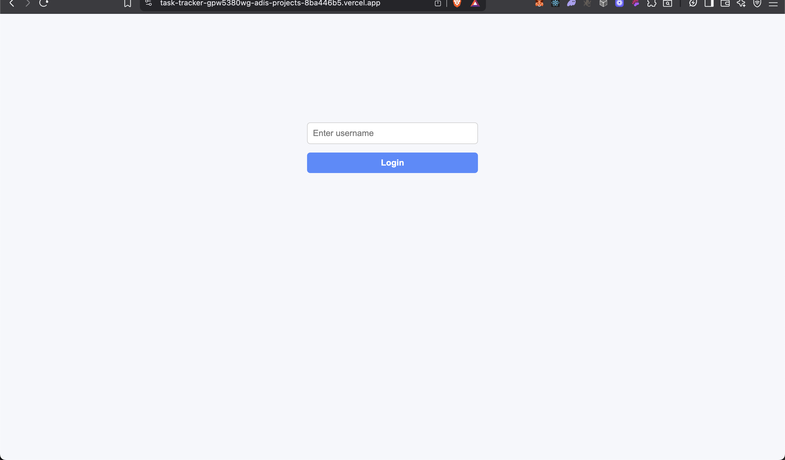
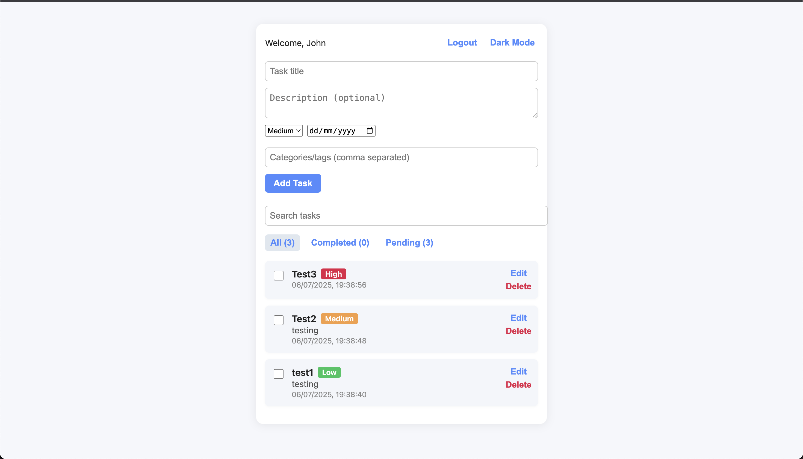
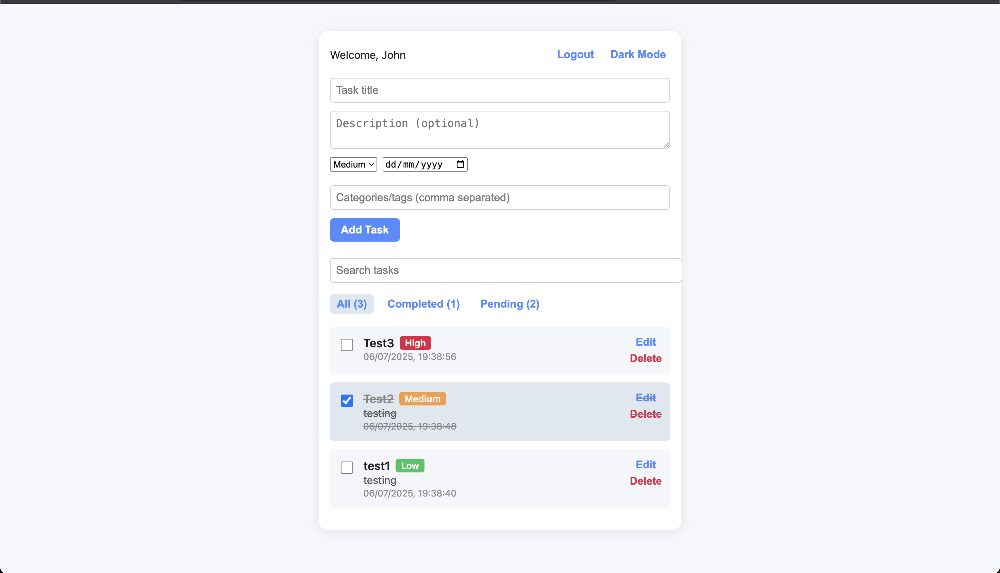

# Personal Task Tracker

## 📖 Description

A simple web app to manag your daily tasks. Add, edit, complete, and delete tsks with a clean intreface. Tasks are saved in your browser.

## 🚀 Features

- User login (username only, no password)
- Add, edit, and delete tasks
- Mark tasks as completed or pending
- Filter tasks (all, completed, pending)
- Tasks persist in browser local storage
- Responsive and clean UI

## 🛠 Setup Instructions

1. Clone the repository
2. Run `npm install`
3. Run `npm start`
4. Open [http://localhost:3000](http://localhost:3000)

## 🧰 Technologies Used

- React.js
- Local Storage

## 🔗 Live Demo

*https://task-tracker-gpw5380wg-adis-projects-8ba446b5.vercel.app/*

## 🖼 Screenshots

